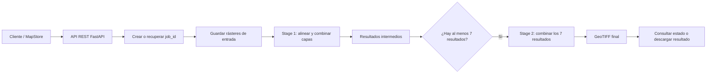

# MapStore GDAL Backend

Backend geoespacial desarrollado con **FastAPI** para ejecutar un flujo definido de procesamiento de capas ráster y exponerlo mediante una API REST consumible por clientes como **MapStore**. El procesamiento utiliza **GDAL** para las operaciones geoespaciales y **NumPy** para el cálculo de los rásteres resultantes.

El procesamiento implementado sigue un esquema de combinación ponderada en dos niveles. En el primer nivel, las capas ráster de cada conjunto se combinan aplicando los pesos definidos para generar un resultado intermedio. Este proceso puede repetirse para distintos conjuntos de capas, produciendo varios rásteres intermedios. En el segundo nivel, estos resultados se utilizan como nuevas entradas y se combinan nuevamente mediante sus respectivas ponderaciones para obtener un único ráster final.

Este esquema permite representar un análisis compuesto: primero se obtiene un resultado para cada conjunto de variables espaciales y posteriormente se integran esos resultados en un cálculo final. Antes de cada combinación, las capas deben ser espacialmente compatibles, por lo que el backend realiza las operaciones de alineación necesarias antes del cálculo.

## Flujo del proyecto

El backend recibe archivos ráster y, según el endpoint utilizado, los procesa como parte de un trabajo identificado por un `job_id`. Cada trabajo cuenta con directorios propios para entradas, resultados intermedios, archivos alineados y resultado final. Su estado se conserva en un archivo `manifest.json`.

El procesamiento sigue, de forma general, este flujo:

1. El cliente envía uno o más rásteres, sus multiplicadores y el nombre de la salida.
2. El backend crea un trabajo nuevo o continúa uno existente.
3. Los archivos se guardan en el directorio del trabajo y sus nombres se sanitizan.
4. Se toma el primer ráster como referencia y se revisa el sistema de coordenadas, la transformación geográfica y las dimensiones de las demás capas.
5. Cuando una capa no coincide con la referencia, se genera una versión alineada. Esto puede incluir reproyección y ajuste de dimensiones. Para datos categóricos se utiliza remuestreo por vecino más cercano.
6. Los rásteres alineados se combinan mediante una suma ponderada. Cada valor válido se multiplica por el multiplicador correspondiente y se acumula en la salida.
7. El resultado se escribe como un archivo GeoTIFF, conservando la referencia espacial del ráster base.
8. El estado y las rutas de los resultados se actualizan en el manifiesto del trabajo.


### Pipeline en dos etapas

`POST /pipeline/start` implementa la primera etapa. Recibe las capas de entrada y genera una salida intermedia. Si se reutiliza el mismo `job_id`, la nueva salida se agrega a la lista acumulada de resultados de `stage1`.

`POST /pipeline/continue` implementa la segunda etapa. El código actual exige que existan al menos siete resultados en `stage1`. Toma los primeros siete, aplica los multiplicadores de esta etapa —o utiliza `1` como valor predeterminado para cada resultado— y genera el GeoTIFF final. El repositorio no documenta el significado específico de esas siete capas; únicamente puede afirmarse que son una regla del flujo actualmente implementado.



Además del flujo principal, la API permite consultar el estado de un trabajo mediante `GET /pipeline/status/{job_id}`, descargar el resultado mediante `GET /pipeline/result/{job_id}` y eliminar los archivos del trabajo mediante `DELETE /pipeline/{job_id}`. También existe un endpoint `POST /pipeline/close` para solicitar la limpieza de un trabajo en segundo plano.

## Ejecución con Docker

Docker es la forma recomendada de ejecutar el backend. El `Dockerfile` construye una imagen basada en Micromamba e instala un entorno con:

- Python 3.11
- GDAL 3.13.2
- NumPy 1.26.4
- Las dependencias Python declaradas en `requirements.txt`, incluyendo FastAPI, Starlette, Uvicorn, Pydantic y `python-multipart`.

### Requisitos

- Git
- Docker

### Clonar, construir y ejecutar

```bash
git clone https://github.com/Naranjiita/mapstore-gdal-backend.git
cd mapstore-gdal-backend

docker build -t mapstore-gdal-backend .
docker run --rm -p 8000:8000 mapstore-gdal-backend
```

El contenedor inicia Uvicorn y expone la aplicación en el puerto `8000`.

Para comprobar que el servicio está activo, abrir `http://localhost:8000/`. La documentación interactiva OpenAPI/Swagger de FastAPI está disponible en `http://localhost:8000/docs`.

## Configuración e integraciones externas

El backend puede iniciar sin configurar GeoNetwork. La carga de metadatos mediante `POST /upload_geonetwork/` requiere las siguientes variables de entorno:

```text
GEONETWORK_USER=<usuario>
GEONETWORK_PASSWORD=<contraseña>
GEONETWORK_SERVER=<URL_BASE_DE_GEONETWORK>
```

No se deben incluir credenciales reales en el repositorio. Pueden pasarse al contenedor mediante un archivo de variables o con opciones de Docker:

```bash
docker run --rm -p 8000:8000 --env-file .env mapstore-gdal-backend
```

El archivo `.env` debe mantenerse fuera del control de versiones. La integración utiliza las credenciales para autenticarse en GeoNetwork y posteriormente cargar el archivo XML de metadatos. El código desactiva la verificación de certificados TLS para estas solicitudes, por lo que esta integración debe configurarse considerando las condiciones de seguridad del entorno donde se despliegue.

Los archivos de trabajo se almacenan dentro del contenedor en rutas bajo `app/`. Al ejecutar el contenedor con `--rm`, estos datos se eliminan cuando el contenedor termina, salvo que se configure un volumen explícito. El repositorio no define un volumen obligatorio ni una política de persistencia externa.

## Tecnologías principales

- **Python 3.11**: lenguaje de implementación.
- **FastAPI**: framework para exponer la API REST y la documentación OpenAPI.
- **Uvicorn**: servidor ASGI utilizado para iniciar la aplicación.
- **GDAL 3.13.2**: lectura, reproyección, alineación, ajuste y escritura de datos geoespaciales.
- **NumPy 1.26.4**: cálculo matricial de la suma ponderada por bloques.
- **Docker y Micromamba**: empaquetado del entorno de ejecución.
- **GeoNetwork**: integración externa opcional para cargar metadatos XML.

## Endpoints principales

| Método | Ruta | Propósito |
|---|---|---|
| `GET` | `/` | Comprobar que la API está funcionando. |
| `POST` | `/pipeline/start` | Cargar rásteres y generar una salida intermedia. |
| `POST` | `/pipeline/continue` | Generar el resultado final a partir de siete resultados intermedios. |
| `GET` | `/pipeline/status/{job_id}` | Consultar el manifiesto y estado del trabajo. |
| `GET` | `/pipeline/result/{job_id}` | Descargar el GeoTIFF final. |
| `DELETE` | `/pipeline/{job_id}` | Eliminar los archivos del trabajo. |
| `POST` | `/upload_geonetwork/` | Cargar un XML de metadatos en GeoNetwork. |

Los esquemas completos de solicitudes y respuestas pueden consultarse en `/docs` después de iniciar el servicio.
